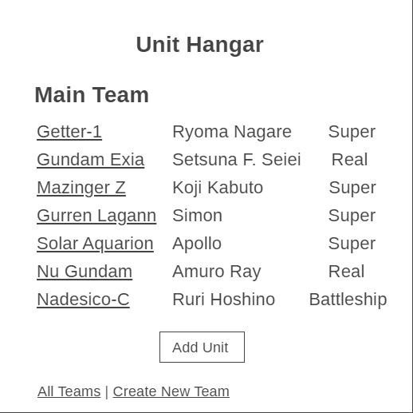

# UnitHangar 

## Overview

Playing strategy games can get really annoying when you have a seemingly uncountable amount of player units, and you end up forgetting what each character does and how strong or weak they are. I personally am a big fan of a franchise called Super Robot Wars, but there are often so many playable units in that game that I start to lose track. This is where UnitHangar will come in to help.

UnitHangar is a web app that will allow users to keep track of their units when playing Super Robot Warss. Users can can create their database of characters. For each list they have, they can add or remove items.


## Data Model

The application will store Users, Teams, and Units

* users can have multiple teams (via references)
* each team can have multiple units (by embedding)

An Example List with Embedded Items:

```javascript
{
  user: // a reference to a User object
  team: "Main Team",
  units: [
    { name: "Getter-1", pilots: ["Ryoma Nagare", "Hayato Jin", "Musashi Tomoe"], type: "Super", attacks: 6, HP: 10500 },
    { name: "Gundam Exia", pilots: ["Setsuna F. Seiei"], type: "Real", attacks: 5, HP: 5500 },
  ],
  createdAt: // timestamp
}
```


## [Link to Commented First Draft Schema](db.js) 

## Wireframes

/list/create - page for creating a new team


/list - page for showing all teams


/list/slug - page for showing specific team



/list/slug/create - page for adding a new unit to a team


/list/slug/slug - page for looking at unit information


## Site map


## User Stories or Use Cases

1. as a user, I can create a new team
2. as a user, I can view all of the the teams i've created in a single list
3. as a user, I can add units to an existing team
4. as a user, I can look at specific unit information


## [Link to Initial Main Project File](app.js) 
